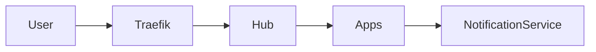

# Architecture

## Hub vs Apps Separation
The Hub is the main entry point and is isolated as `apps/hub`. Other apps (e.g., `apps/invoice`) ship as separate containers and are routed by Traefik.

## Notification Service (Future)
A dedicated notification service is reserved as a future component. It should be deployed as a separate service with its own API and queueing strategy, not embedded inside the Hub.

## Health Endpoint
The Hub exposes `GET /api/health` and returns HTTP 200. It is used by deploy checks and external health verification.

## Deploy Flow
1. GitHub Actions builds the Hub image.
2. Image is pushed to GHCR tagged by commit SHA.
3. Workflow SSHes into the VPS.
4. Compose pulls the new image and recreates the Hub container.
5. Gate scripts validate readiness and TLS.
